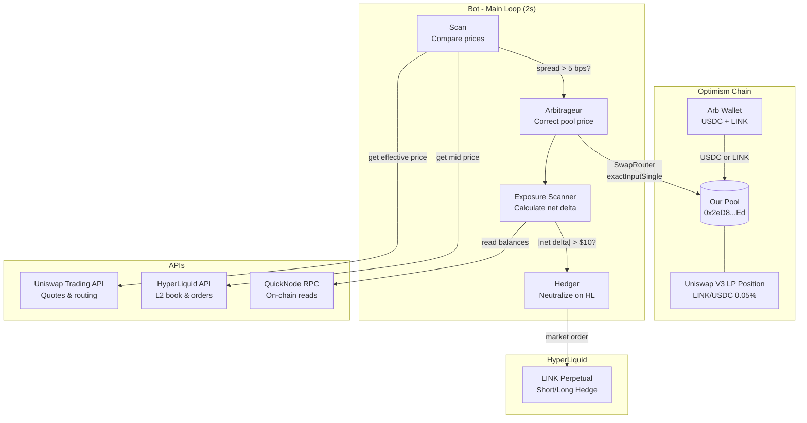
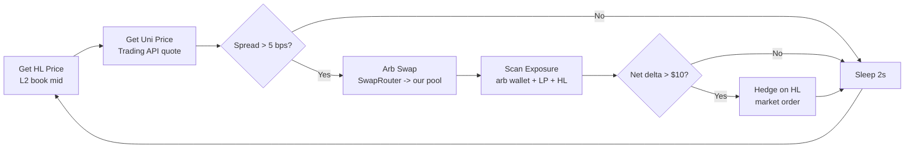

# Legacy Internal Strategy Notes

> Status: historical documentation for the older single-wallet bot.
>
> For the current managed product, start with the root [README](../README.md).
>
> In the current Moeazi architecture, the only files from this folder that are directly connected are:
> `convex_supervisor.py`, `convex_worker_client.py`, `managed_runtime.py`, `uniswap_client.py`, and `hyperliquid_client.py`.

# LINK/USDC Delta-Neutral Market Maker

Delta-neutral market making bot that provides concentrated liquidity on Uniswap V3 (Optimism) and hedges directional risk on HyperLiquid perpetuals.

## Strategy

Earn LP fees from a Uniswap V3 LINK/USDC pool while staying delta-neutral:

1. **Provide liquidity** in a concentrated range on our own Uniswap V3 pool (0.05% fee tier)
2. **Arbitrage** our pool's price back to the market (HyperLiquid) whenever it drifts
3. **Hedge** net LINK exposure on HyperLiquid perps to eliminate directional risk

Profit comes from LP fees. The arb protects against adverse selection, and the hedge removes price risk.

## Architecture



## Main Loop



## Key Design Decisions

### Why Trading API for price discovery?
The API's `/quote` endpoint gives a realistic effective price accounting for routing, slippage, and fees — better than raw `slot0` for spread calculation. We call it every scan cycle to detect mispricing accurately.

### Why Trading API for rebalancing?
Rebalancing the arb wallet to 50/50 doesn't need to hit our pool specifically. The API finds the best price across all LINK/USDC liquidity on Optimism, minimizing slippage.

### Exposure = on-chain delta + HL position
The hedger calculates **net** exposure across all three components:
- Arb wallet LINK (long) and USDC
- LP position token amounts + unclaimed fees
- Existing HL perp position

Only hedges the residual, preventing oscillation.

## Components

| File | Role |
|------|------|
| `main.py` | Main loop — arb scan, exposure check, hedge |
| `arbitrage_engine.py` | Detects mispricing, executes arb via SwapRouter |
| `exposure_scanner.py` | Calculates net LINK delta across arb + LP + HL |
| `hedger.py` | Adjusts HL perp to neutralize exposure |
| `executor.py` | Trade execution — SwapRouter, Uniswap API, HL orders |
| `uniswap_client.py` | Pool reads (RPC) + quotes (Trading API) |
| `hyperliquid_client.py` | HL price feeds + L2 book |
| `balance_tracker.py` | Balance monitoring across all three venues |
| `gas_estimator.py` | Optimism gas cost estimation |
| `rebalance.py` | Manual 50/50 rebalance via Uniswap Trading API |
| `config.py` | All parameters and addresses |

## Configuration

| Parameter | Default | Description |
|-----------|---------|-------------|
| `ARB_THRESHOLD_BPS` | 5 | Minimum spread (bps) to trigger arb |
| `HEDGE_EXPOSURE_THRESHOLD_USD` | $10 | Minimum net delta to trigger hedge |
| `MAX_ARB_TRADE_USD` | $5 | Maximum single arb trade |
| `MIN_ARB_TRADE_USD` | $1 | Minimum arb trade (below = skip) |
| `SLIPPAGE_TOLERANCE` | 50% | Loose for testing |
| `POLL_INTERVAL_SECONDS` | 2 | Main loop interval |

## API Usage Per Cycle

| API | Calls | Purpose |
|-----|-------|---------|
| **Uniswap Trading API** | 1 `/quote` | Price discovery (every scan) |
| **Uniswap Trading API** | 2-3 | On arb execution: `/check_approval` + `/quote` + `/swap` (rebalance only) |
| **HyperLiquid API** | 1 `l2Book` | Reference price |
| **HyperLiquid API** | 1-2 | On hedge: `clearinghouseState` + market order |
| **QuickNode RPC** | ~8 | `slot0`, `balanceOf`, LP position reads |

## Setup

```bash
# Install dependencies
pip install web3 eth-account requests python-dotenv hyperliquid-python-sdk

# Configure .env
cp .env.example .env
# Fill in: PRIVATE_KEY, HL_PRIVATE_KEY, HL_WALLET_ADDRESS, LP_WALLET_ADDRESS, UNISWAP_API_KEY

# Check balances
python balance_tracker.py

# Check exposure
python exposure_scanner.py

# Rebalance arb wallet (dry run)
python rebalance.py

# Rebalance arb wallet (execute)
python rebalance.py --execute

# Run the bot
python main.py
```

## Startup Checks

The bot verifies on startup:
1. Uniswap pool connectivity (reads `slot0`)
2. HyperLiquid API connectivity (reads mid price)
3. Full exposure scan (arb wallet + LP + HL position)
4. Warns if net exposure exceeds hedge threshold (hedger corrects on first cycle)

## Contracts

| Contract | Address | Network |
|----------|---------|---------|
| LINK/USDC Pool (0.05%) | `0x2eD85aD8093FdefF2f5B0b1CfcA560dDc03c48Ed` | Optimism |
| SwapRouter | `0xE592427A0AEce92De3Edee1F18E0157C05861564` | Optimism |
| NonfungiblePositionManager | `0xC36442b4a4522E871399CD717aBDD847Ab11FE88` | Optimism |
| LINK | `0x350a791Bfc2C21F9Ed5d10980Dad2e2638FFa7f6` | Optimism |
| USDC | `0x0b2C639c533813f4Aa9D7837CAf62653d097Ff85` | Optimism |
