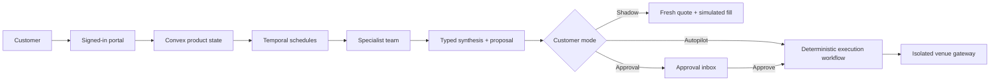
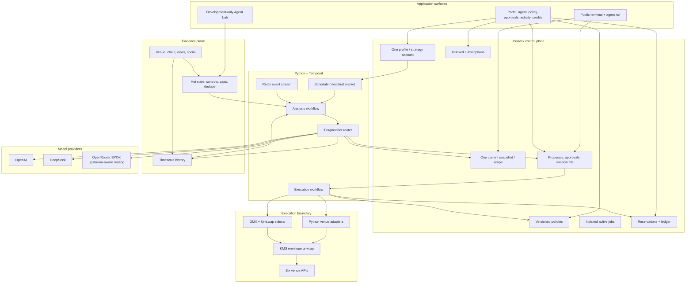
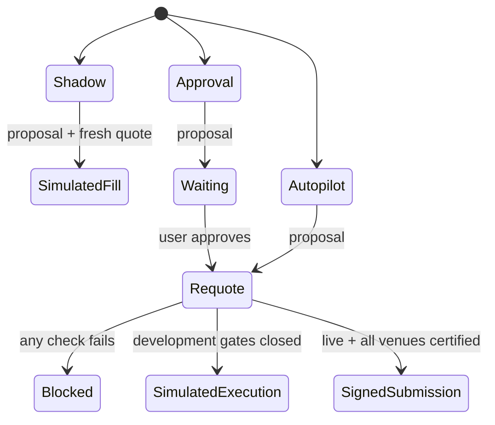
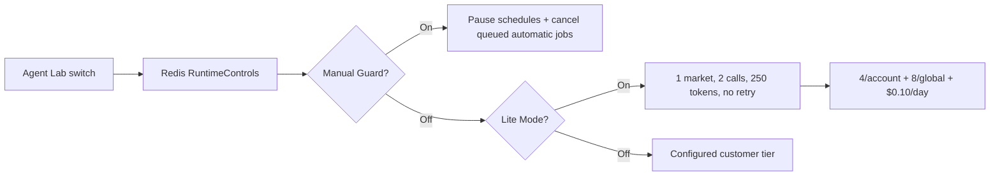
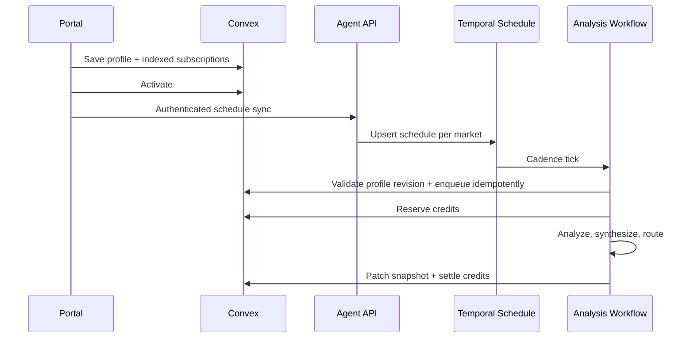
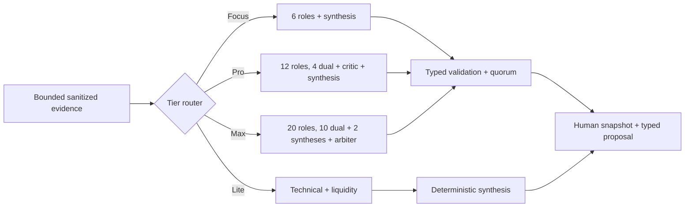
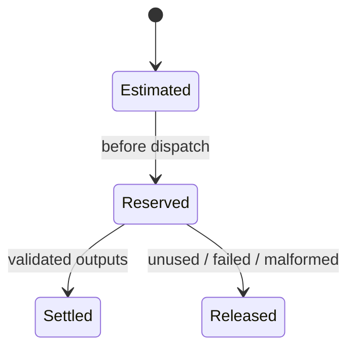
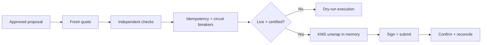

# Autonomous Agent Backend Architecture

> Active venue ownership and chain boundaries are documented in [Arbitrum-first venue architecture](./arbitrum-venue-architecture.md). Optimism references below describe legacy migration behavior only.

## Principles

- Convex owns customer-visible state; Timescale owns detailed history.
- Temporal schedules and workflows own autonomous work. No process polls Convex.
- Shadow, Approval, and Autopilot all analyze automatically; only authority differs.
- Manual Guard and Lite Mode are development controls, not customer modes.
- Analysis workers never receive credentials or venue execution tools.
- Runtime authority is the lowest of deployment, user, policy, credits, and health ceilings.

## Entire system — simplified

The public terminal shows status and explanations. Wallets, strategies, policies, credits,
approvals, and configuration stay in the portal.

## Entire system — detailed

## 1. Modes and runtime authority

Why: analysis stays consistent while authority remains explicit and auditable. Legacy `insights`
normalizes to Shadow. Every real submission checks deployment, policy, credits, evidence, quorum,
venue health, quote freshness, balance/exposure/loss, emergency stop, reconciliation, and idempotency.

Improve next: persist a customer-readable authority-decision object for every proposal.

## 2. Development safeguards

Why: missing Redis state resolves to both safeguards on. Disabling either requires typed cost
confirmation. Manual runs remain possible. One atomic Redis script protects concurrent daily caps.

Improve next: reconcile provider-returned usage against the pre-dispatch maximum reservation.

## 3. Scheduling and dispatch

Why: idle workers make zero Convex calls. Revisions invalidate stale ticks, status indexes avoid
historical scans, and account/market indexes prevent overlap.

Improve next: complete the Redis material-event consumer and a transactional schedule-sync outbox.

## 4. Agent analysis and evidence

Why: external text is evidence, never instructions. Provenance and hashes remain attached. Compact
inputs stop recursive token growth. Provider details are stored for audit but hidden from customer UI.

Improve next: outcome-calibrate roles and omit roles whose source freshness misses its objective.

## 5. Credits and current-state storage

Convex patches one current public market snapshot and one private account/market snapshot. Timescale
retains evidence, calls, syntheses, and evaluations. Integer credits plus a versioned rate card preserve
billing history before checkout exists.

Improve next: add per-role cost/value attribution and automatic Convex IO budgets.

## 6. Execution and custody

Why: analysis cannot sign. Raw credentials exist only inside the gateway and are zeroed after use.
A broadcast Uniswap transaction is reconciled, never described as cancellable.

Improve next: finish private signing adapters and move signing into short-lived hardware-backed workers.
Production remains blocked until all six sandbox suites and funded canaries pass.

## Failure model

| Failure | Safe behavior |
|---|---|
| Redis state missing | Manual Guard ON and Lite Mode ON |
| Duplicate tick/approval | Active index + idempotency returns existing work |
| Worker/API restart | Temporal resumes |
| Provider invalid/timeout | No user billing; Lite never retries |
| Credits exhausted | Dispatch/execution blocks |
| Stale evidence or lost quorum | Autopilot blocks |
| Emergency stop race | Fresh preflight wins before signing |
| Venue degraded/drift | Circuit breaker blocks |
| Live/certification gate closed | State machine records a simulation |
