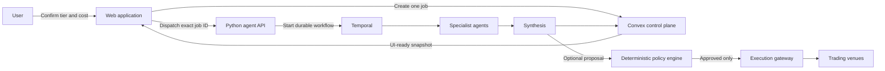
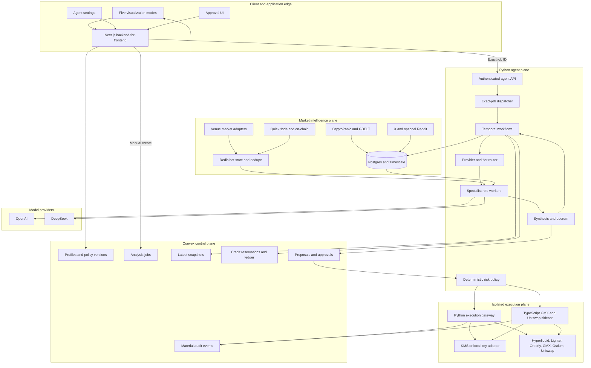
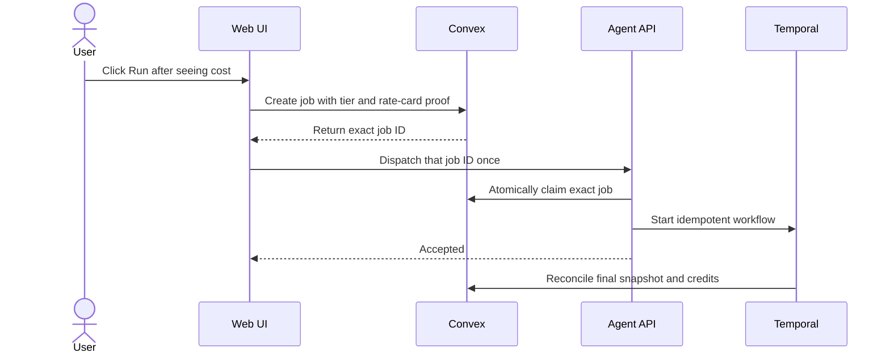
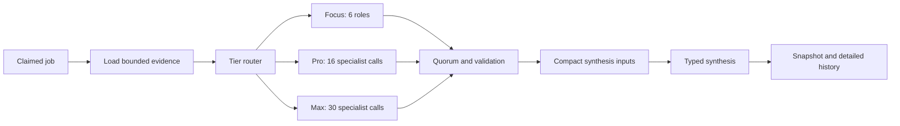
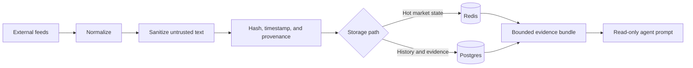
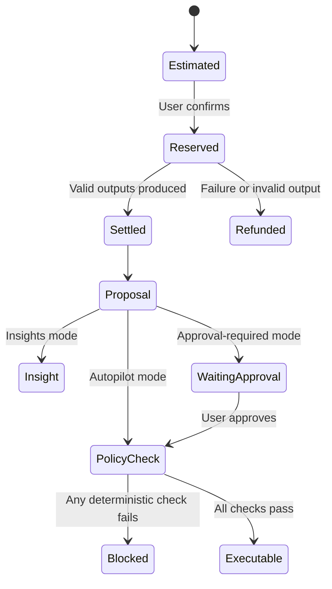
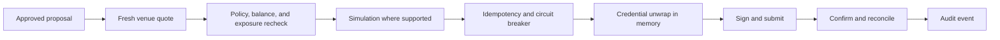
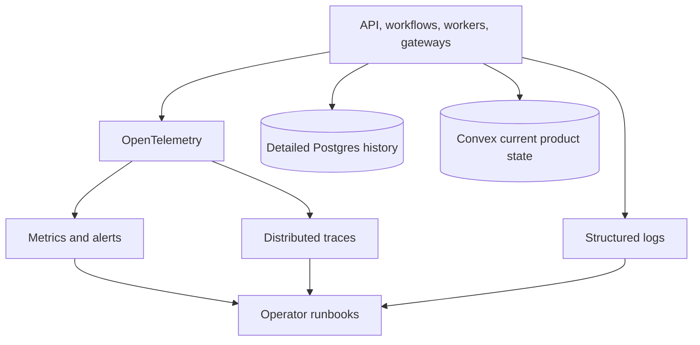

# Agentic Trading Backend Architecture

## Goals and non-negotiable rules
- Analysis starts only after an explicit, price-confirmed user request.
- An idle system performs zero queue polling and zero visualization heartbeats.
- Convex is the product-state authority; Postgres stores detailed analytical history.
- Temporal owns durable long-running work. LLM workers never receive trading credentials.
- LLM output is evidence and proposals, never authority to sign or submit an order.
- Every paid run is bounded by a versioned rate card, model route, evidence limit, and token cap.

## Entire system — simplified

The important boundary is the split between analysis and execution. Agents can recommend; only deterministic code can authorize, sign, and submit.

## Entire system — detailed

## Component 1 — manual control and dispatch

Why this design:

- There is no idle `claimNext` loop, so an idle deployment consumes no queue reads.
- Exact-job claiming prevents one account from taking another account's work.
- The job ID is also the Temporal idempotency key, preventing duplicate workflows.
- Rate-card proof is checked in Convex and again in Python before provider use.

Possible improvements:

- In cloud environments, replace the browser dispatch hop with a signed Convex-to-agent webhook.
- Add an outbox table so failed dispatch notifications are retried without scanning the jobs table.

## Component 2 — durable multi-agent analysis

Why this design:

- Temporal retries recover from worker failure without duplicating a workflow.
- Tier routing makes cost and latency predictable before the user confirms.
- Typed outputs and quorum checks prevent one malformed provider response from becoming a trade.
- Compact synthesis materials prevent reports from recursively repeating all evidence.

Possible improvements:

- Dynamically skip low-value roles when deterministic data quality is insufficient.
- Use evaluation scores to route each role to the best-performing model.

## Component 3 — evidence ingestion and trust boundary

Why this design:

- Provenance and content hashes make every conclusion auditable.
- News and social text remain data; embedded instructions never become system commands.
- Redis serves current state while Postgres preserves history and evaluation evidence.
- Evidence count and character limits create a hard cost boundary.

Possible improvements:

- Add source-specific freshness service-level objectives.
- Detect duplicate stories across providers with semantic fingerprints.

## Component 4 — credits, policy, and authority

Why this design:

- Reservation prevents a run from exceeding the user's budget.
- Settlement bills validated output only; operational retries are platform cost.
- Versioned policy fields are deterministic and can be reproduced during an audit.
- Authority changes and natural-language policy drafts never activate silently.

Possible improvements:

- Add per-role cost attribution and cost-versus-value reports.
- Let users set a monetary ceiling in addition to integer credits.

## Component 5 — isolated trade execution

Why this design:

- Analysis workers have no execution tools or credentials.
- A fresh quote and second policy check close the gap between analysis time and execution time.
- Idempotency keys and reconciliation prevent duplicate or phantom orders.
- KMS-backed envelope encryption limits credential exposure to one process boundary.

Possible improvements:

- Move signing into isolated short-lived workers or hardware-backed key services.
- Add venue-specific chaos tests and automatic degradation scoring.

## Component 6 — storage and observability

Why this design:

- Convex stays small and reactive instead of becoming an analytical warehouse.
- Postgres retains provider calls, evidence, evaluations, and time-series syntheses.
- Shared trace IDs connect a user request, Temporal workflow, provider call, and execution.

Possible improvements:

- Add explicit budgets for Convex executions, provider tokens, and venue API calls.
- Alert on idle background traffic greater than zero.
- Add per-market freshness, failure-rate, and reconciliation-drift dashboards.

## Scaling and failure model
| Failure | Expected behavior |
|---|---|
| Browser closes after dispatch | Temporal continues; result reconciles to Convex |
| Duplicate Run click | Convex returns the active job; exact claim and workflow ID deduplicate |
| Agent API restarts | Already-started Temporal workflow continues |
| Provider timeout | Bounded retry; invalid output is not user-billed |
| Worker crashes | Temporal replays and schedules the activity elsewhere |
| Convex unavailable | Workflow reconciliation retries; execution remains blocked |
| Evidence is stale | Quorum/policy blocks proposal or marks analysis degraded |
| Venue is degraded | Circuit breaker prevents submission |

## Improvement roadmap
1. **Now:** event-driven exact-job dispatch, no viewer heartbeat, legacy poller disabled.
2. **Next:** transactional outbox and signed service webhook for browser-independent dispatch.
3. **Scale:** autoscale Temporal workers by task-queue depth and split ingestion by source.
4. **Quality:** continuous role/model evaluations and outcome-calibrated confidence.
5. **Safety:** isolated signing service, independent reconciliation observer, chaos canaries.
6. **Cost:** hard daily Convex, token, and provider budgets with automatic operator alerts.
