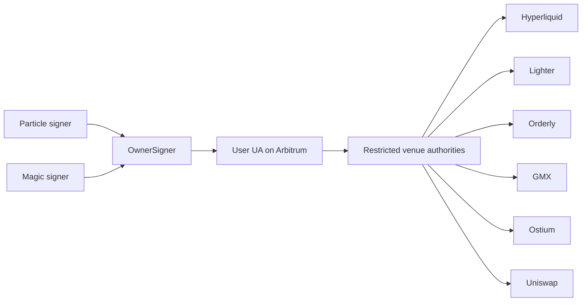
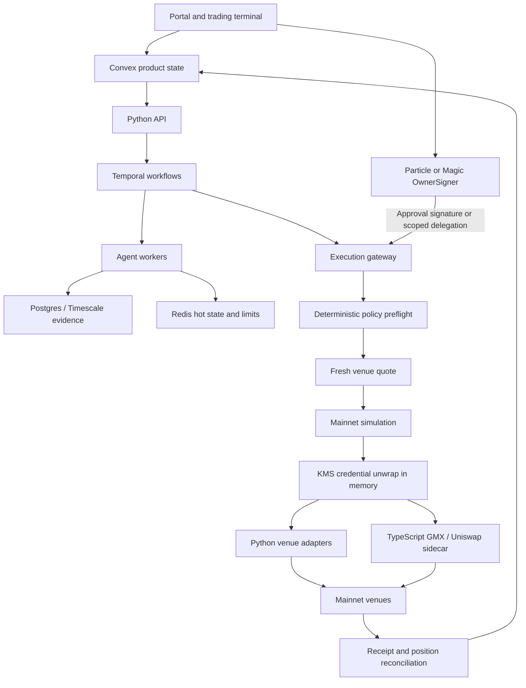
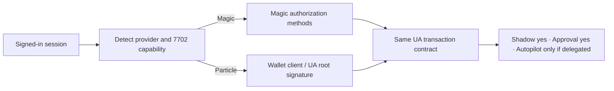
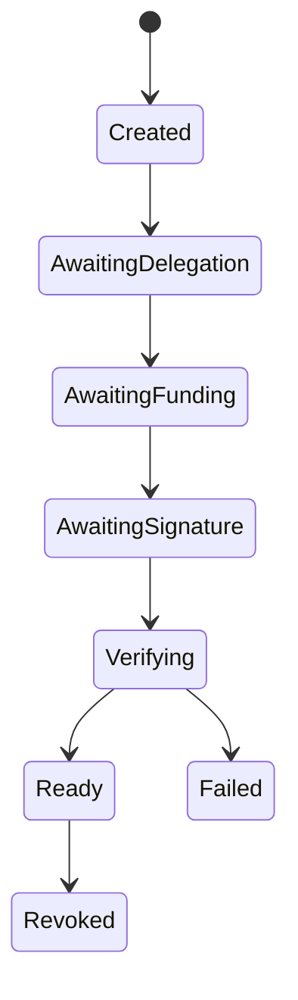
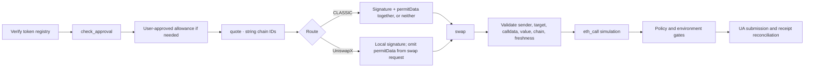
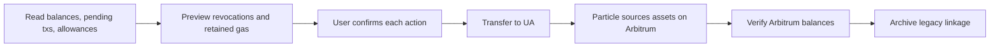

# Arbitrum-first venue architecture

## What changed

Arbitrum `42161` is the only active EVM strategy chain. Particle and Magic are interchangeable owner signers. The user's Universal Account (UA) is the strategy owner; Moeazi never creates or stores a fallback owner key. Venue accounts are protocol linkages and restricted delegates under that owner.

Optimism is legacy-read-only. It can remain visible in Particle's unified balance and can be the source of a user-confirmed migration, but it is not used by new strategies or active Uniswap routing.

## Simplified system

Why: the user has one ownership boundary while each venue receives only the permission it needs. A compromised venue delegate cannot become the user's owner key.

## Full control and data plane

Why: Convex remains the user-facing source of truth, Temporal owns long waits and retries, and execution is isolated from LLM workers. No agent receives credentials or signing tools.

## Owner signer

Why: product code uses one contract instead of branching on provider throughout the application. Unsupported Particle wallets fail down to Shadow or Approval and never silently gain Autopilot authority.

Improve next: add wallet-specific contract fixtures for session expiry and authorization replacement, then support audited permission modules when the selected UA implementation exposes them.

## Venue setup workflow

Convex stores material state. Temporal waits for user signatures without polling Convex. The gateway generates credentials, keeps encrypted envelopes behind KMS, and signals verification only after mainnet collateral and authority checks pass. Routing cannot be enabled before `Ready`.

Why: setup and order submission have separate environment gates. Setup does not spend agent credits or call an LLM.

Improve next: implement each protocol verifier and transaction builder against recorded mainnet responses, then certify tightly capped funded canaries. Until then, attempts remain `Verifying` and live routing stays off.

## Uniswap on Arbitrum

The active registry contains native Arbitrum USDC and WETH. LINK is versioned and must match deployed bytecode, symbol, decimals, and chain at runtime. Quotes older than 30 seconds are rejected. WETH is never fully unwrapped automatically.

Why: Trading API routing can select V2, V3, V4, or UniswapX without hardcoded pool assumptions, while target allowlists keep returned calldata bounded.

Improve next: maintain the UniswapX reactor allowlist from audited deployment metadata, persist receipt reconciliation, and add an audited bundler-based scoped delegation before smart-account Autopilot is certified.

## Legacy Optimism migration

No bridge, transfer, allowance revocation, or archive occurs automatically. A migration stays open until both sides reconcile.

## Safety gates

Runtime authority is the minimum of deployment ceiling, user mode, active policy, credit state, venue health, reconciliation health, and credential status. Development continues to default to Manual Guard ON, Lite Mode ON, `MAINNET_VENUE_SETUP_ENABLED=false`, and `LIVE_EXECUTION_ENABLED=false`.

The architecture is intentionally incomplete for live release until all six mainnet adapters have deterministic setup verification, duplicate-credential protection, receipt reconciliation, revocation tests, recorded response tests, fork simulations, and capped funded canaries.
