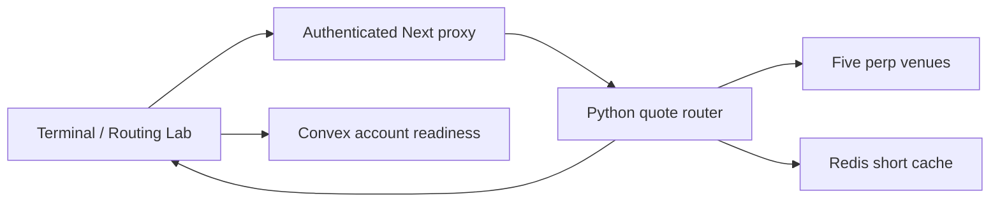
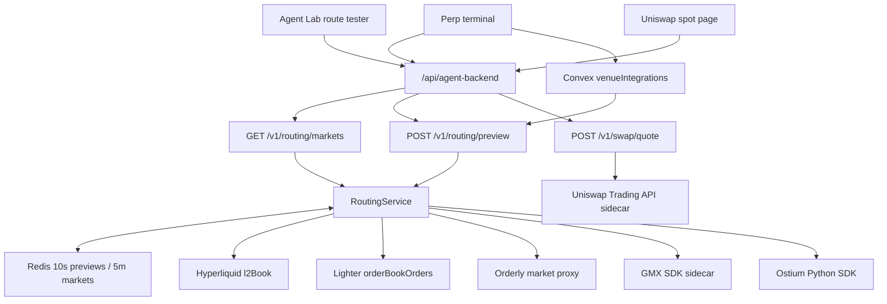

# Venue routing and web-app integration

This milestone is intentionally read-only. It discovers public markets, compares fresh quotes, and
simulates the selected route. It never requests an approval, signature, funding transfer, or broadcast.

## Simple view

Why: public market traffic does not pass through Convex, so quote refreshes produce zero Convex writes.
Convex answers only the user-specific question: which venue accounts are ready?

## Detailed view

### Market catalog

Each adapter emits `MarketListing`; the service canonicalizes symbols and creates a union keyed by base
market. A partial venue outage removes only that venue. The catalog cache prevents repeated discovery.

Why: users see every reachable market without pretending that one venue is the canonical catalog.

Improve: replace symbol heuristics with a versioned instrument registry containing contract, chain,
collateral, settlement, and expiry identifiers.

### Normalized quote adapters

Hyperliquid and Lighter use real public depth. Orderly, GMX, and Ostium currently use an explicitly named
price/liquidity proxy when a public preparation endpoint does not expose a complete unsigned book. Proxy
sources stay visible in technical details and use conservative spreads.

Why: the router can fail a venue independently and never fabricates a successful executable quote.

Improve: maintain Orderly WebSocket books, call GMX `prepareOrder` with a non-signing managed address, and
replace Ostium's proxy with the protocol's exact price-impact calculation.

### Cost and selection

The route models entry and exit taker fees, entry and exit depth impact, and funding over the requested
hold time. Setup cost is separate and never hidden inside execution cost. Candidates are ordered by:

1. Rounded all-in cost (one-cent tie tolerance).
2. Freshness.
3. Stable venue priority.

`bestMarketVenue` is the cheapest public route. `bestExecutableVenue` is the cheapest account-ready route.
The terminal selects the latter and explains when a cheaper venue requires setup. A user override is
accepted only for an eligible, ready venue.

Why: a cheaper route is useless if the account cannot execute it, but hiding it prevents users from
improving their setup.

Improve: add gas quotes, bridge inventory opportunity cost, rebates, VIP fee tiers, and probability-weighted
execution/fill risk.

### Readiness control plane

`venueIntegrations` records enabled/readiness state without storing credentials. `venueAccounts` remains
the credential-bearing execution record. Enabling an integration creates only a setup requirement; it does
not generate a key or authorize a venue automatically.

Why: control-plane intent and credential custody have different lifecycles and audit requirements.

Improve: add a durable provisioning workflow that creates the minimum venue credential only after explicit
authorization, then patches readiness after a read-only account probe.

### Uniswap spot quote

The `/swap` page sends an exact-input request through the sidecar. CLASSIC and UniswapX output shapes are
parsed separately. The page ends at quote display; `/swap`, approval, signing, and broadcast are not called.

Why: Uniswap spot routing is not comparable to leveraged perpetual venues and deserves a simpler product
surface and a separate safety boundary.

Improve: add token metadata discovery, chain selection, allowance display, price impact, route legs, and an
explicit confirmation flow only after execution certification.

## Safety and failure behavior

| Condition | Behavior |
|---|---|
| One venue times out | Other venues still return |
| Quote older than 60 seconds | Venue excluded |
| Insufficient depth | Venue excluded |
| Leverage/minimum violation | Venue excluded with a readable reason |
| Cheapest venue unready | Ready runner-up selected; setup requirement shown |
| Override unready | Override ignored with warning |
| Redis unavailable in development | Request fails; no fallback transaction or Convex polling |
| Live execution disabled | Terminal simulation only |

## Production exit criteria

- Replace every proxy quote with venue-exact unsigned preparation or maintained depth.
- Add fee-tier/account-specific inputs and gas estimation.
- Pass recorded contract tests plus rate-limit, timeout, malformed, and stale-data cases.
- Reuse this router inside agent proposal/execution workflows so UI and agents cannot disagree.
- Keep broadcast gated until all venue sandbox suites and funded canaries are certified.
